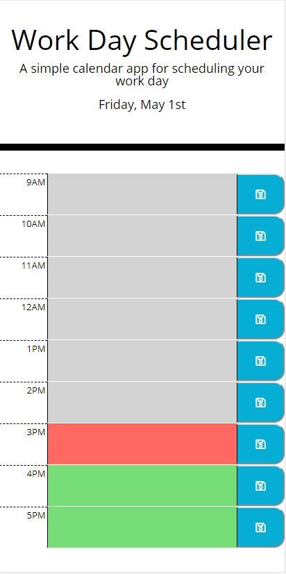
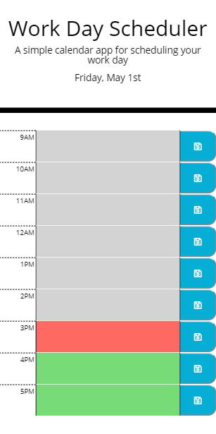
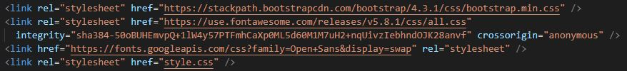
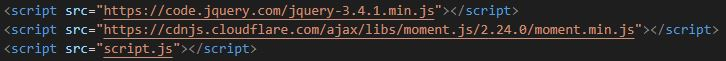
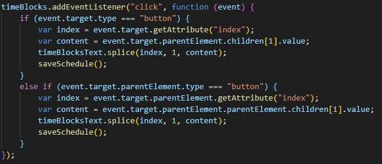
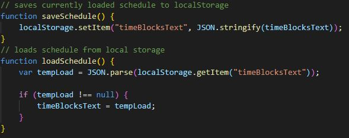

# hw-05-third-party-apis
Week 5 Homework

In this assignment we were tasked with creating a calendar application which allowed the user to save events for each hour of the work day. The user could then save and reload these events via local storage. The application also needed to utilize moment.js to display the current day, as well as allowing each hour in the day to change color depending on if the hour has occured, is occuring, or is in the future.

## Technology Used
In this assignment we relied heavily on event delegation and the third party API moment.js. We also used jquery and bootstrap libraries.

## The Webpage
Utilizing bootstraps grid functionality, as well as media queries, I was able to make this application responsive to screen size. Here is a screen shot of the application pulled up on a Pixel 2 XL cell phone:

Here is a quick gif of the application running, including a refresh which shows the local storage capabilities:

## The Code
There was a few snippets of code that made this application work. The first would the the various style and script links for bootstrap, jquery and moment.js, as shown:

Here you can see the event delegation I used to make the save buttons work:

Finally, the code that allows me to save and load the events from local storage:

